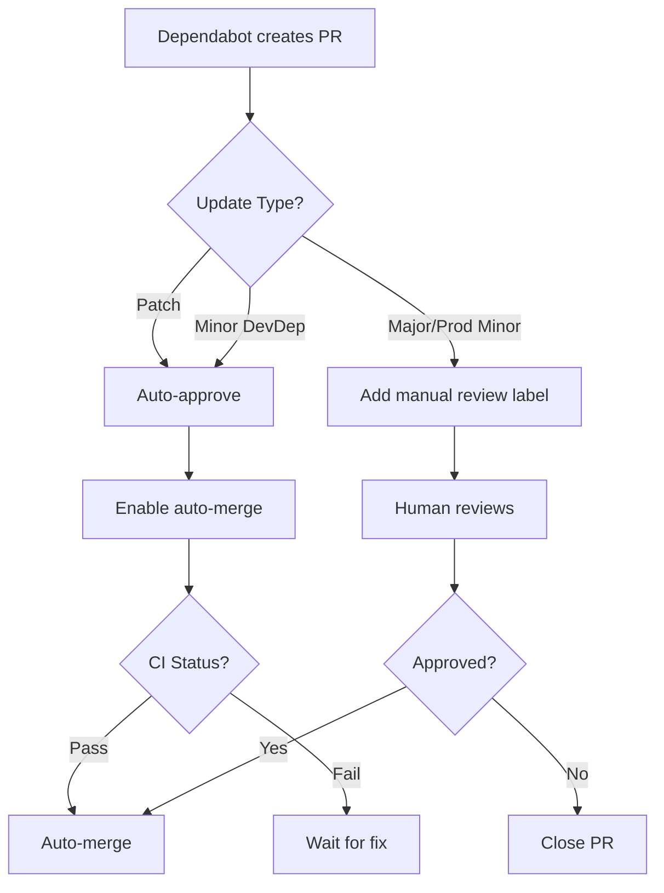

# Dependabot Security Setup - Complete Configuration

## 📋 Mission Complete

Successfully configured automated dependency updates and security scanning for PrayerMap.

## ✅ Files Created

### 1. Core Configuration

**`.github/dependabot.yml`** - Dependabot version updates configuration
- ✅ npm ecosystem for root package.json
- ✅ npm ecosystem for admin/package.json
- ✅ GitHub Actions ecosystem
- ✅ Weekly update schedule (Mondays 9 AM EST)
- ✅ Intelligent grouping (React, Capacitor, Radix UI, Supabase, Testing, Build tools)
- ✅ Major version updates ignored (manual review required)
- ✅ Patch updates grouped for auto-merge
- ✅ 10 open PR limit to prevent overwhelming reviews

### 2. Security Workflows

**`.github/workflows/security.yml`** - Comprehensive security scanning
- ✅ **CodeQL Analysis** - JavaScript & TypeScript SAST
- ✅ **npm Audit** - Dependency vulnerability scanning (root + admin)
- ✅ **Dependency Review** - PR-only check for new vulnerabilities
- ✅ **License Compliance** - Identifies problematic licenses
- ✅ **Security Summary** - Aggregated results dashboard
- ✅ Runs on: push, PRs, weekly schedule, manual trigger
- ✅ Fails on: Critical vulnerabilities
- ✅ Warns on: High vulnerabilities, bundle size increases

### 3. Auto-Merge Automation

**`.github/workflows/dependabot-auto-merge.yml`** - Smart auto-merge logic
- ✅ Auto-approves patch updates (all dependencies)
- ✅ Auto-approves minor updates (devDependencies only)
- ✅ Requires manual review for major updates
- ✅ Requires manual review for production dependency minor updates
- ✅ Priority handling for security updates
- ✅ Detailed review checklists for manual reviews
- ✅ Aligned with ARTICLE.md quality gates

### 4. Documentation

**`.github/AUTO_MERGE_RULES.md`** - Comprehensive auto-merge strategy
- ✅ Green/Yellow/Red light classification
- ✅ Mobile-specific update requirements
- ✅ Quality gate alignment (ARTICLE.md)
- ✅ Emergency override procedures
- ✅ Memory logging templates
- ✅ Weekly/monthly review schedules

## 🎯 Auto-Merge Rules Summary

### ✅ Auto-Merge Approved (Green Light)

**Automatically merges after CI passes:**
1. **All patch updates** (x.y.Z)
   - Example: `react@19.2.0` → `react@19.2.1`
   - Rationale: Bug fixes only, backward compatible

2. **Security patches** (any severity)
   - Example: Fixes for CVEs
   - Rationale: Security is non-negotiable

### ⚠️ Auto-Merge with Caution (Yellow Light)

**Merges with additional checks:**
1. **Minor devDependency updates** (x.Y.z)
   - Examples: `vitest@4.0.14` → `vitest@4.1.0`
   - Requirements: Tests pass, build succeeds, no TS errors, bundle < 5% increase

2. **Grouped ecosystem updates**
   - Ecosystems: Radix UI, Testing tools, Build tools
   - Requirements: All packages update together, comprehensive tests pass

### 🛑 Manual Review Required (Red Light)

**MUST be manually reviewed:**
1. **Major version updates** (X.y.z)
   - Examples: `react@19.x` → `react@20.x`
   - Reason: Breaking changes require code modifications

2. **Production dependency minor updates**
   - Critical deps: `react`, `@supabase/supabase-js`, `@capacitor/*`, `mapbox-gl`
   - Reason: Core features require thorough testing

3. **Mobile-specific dependencies**
   - Examples: All `@capacitor/*` packages
   - Reason: Requires device testing, App Store compliance

## 🔒 Security Scanning Features

### CodeQL Analysis
- **Languages:** JavaScript, TypeScript
- **Schedule:** Weekly + on every push/PR
- **Scope:** Static application security testing (SAST)
- **Action:** Uploads findings to GitHub Security tab

### npm Audit
- **Scope:** Root + admin package.json
- **Severity:** Fails on critical, warns on high
- **Artifacts:** JSON audit reports (30-day retention)
- **Schedule:** Every push, PR, weekly

### Dependency Review
- **Scope:** PR-only vulnerability check
- **Action:** Comments on PRs with findings
- **Allows:** MIT, Apache-2.0, BSD, ISC, CC0, Unlicense
- **Denies:** GPL, AGPL, LGPL (viral licenses)

### License Compliance
- **Tool:** license-checker
- **Output:** JSON report of all package licenses
- **Alerts:** Warns on GPL/AGPL/LGPL/SSPL
- **Artifacts:** License report (30-day retention)

## 📊 Quality Gates (ARTICLE.md Alignment)

All updates must meet these standards before merge:

| Quality Gate | Target | Enforcement |
|--------------|--------|-------------|
| Test Coverage | 85%+ | Required |
| Code Quality (CodeQL) | 90%+ | Required |
| Security Vulnerabilities (Critical) | 0 | Required |
| Security Vulnerabilities (High) | Warn only | Warning |
| Build Success | 100% | Required |
| TypeScript Errors | 0 | Required |
| Bundle Size Increase | < 5% | Warning |
| Performance (Lighthouse) | > 90 | Warning |

## 🚀 How It Works

### Weekly Update Cycle (Mondays 9 AM EST)

1. **Dependabot scans** for outdated dependencies
2. **Creates grouped PRs** by ecosystem/update type
3. **CI runs automatically:**
   - Unit tests (vitest)
   - E2E tests (Playwright)
   - TypeScript compilation
   - Build verification
   - Security scan (CodeQL + npm audit)
4. **Auto-merge workflow evaluates** update type:
   - ✅ Patch updates → Auto-approve + enable auto-merge
   - ⚠️ DevDep minor → Auto-approve + enable auto-merge
   - 🛑 Major/Production → Add "needs-manual-review" label + checklist
5. **Merge happens automatically** when CI passes (for approved updates)

### Pull Request Flow

## 🎬 Getting Started

### Enable Branch Protection (Recommended)

To ensure auto-merge only happens after CI passes:

1. Go to **Settings** → **Branches**
2. Add rule for `main` (or your default branch)
3. Enable:
   - ✅ Require status checks to pass before merging
   - ✅ Require branches to be up to date before merging
   - Required checks:
     - `CI`
     - `E2E Tests`
     - `Security Scanning / CodeQL Security Analysis`
     - `Security Scanning / npm Security Audit`
4. Enable **Allow auto-merge**
5. Save changes

### Enable Dependabot Alerts

1. Go to **Settings** → **Code security and analysis**
2. Enable:
   - ✅ Dependency graph
   - ✅ Dependabot alerts
   - ✅ Dependabot security updates
   - ✅ Dependabot version updates (uses `dependabot.yml`)
3. Save changes

### First Run

After merging this configuration:

1. Dependabot will scan on next Monday 9 AM EST
2. Expect **10-15 PRs** initially (grouped)
3. Review the **"needs-manual-review"** PRs first
4. Watch auto-merge work for patch updates
5. Monitor CI passes before auto-merge completes

## 📝 Monitoring & Maintenance

### Weekly Tasks (Mondays)
- [ ] Review all open Dependabot PRs
- [ ] Merge approved auto-merge PRs (if CI passed)
- [ ] Prioritize security updates
- [ ] Schedule time for major update reviews

### Monthly Tasks (First Monday)
- [ ] Review ignored major updates
- [ ] Plan major version migrations
- [ ] Update auto-merge rules if needed
- [ ] Review dependency health dashboard

### Alerts to Watch
- 🚨 **Critical vulnerabilities** → Immediate action
- ⚠️ **High vulnerabilities** → Review within 48 hours
- 📊 **Bundle size warnings** → Investigate if > 5%
- 🔍 **License violations** → Review compliance

## 🛠️ Troubleshooting

### Auto-merge not working?

**Check:**
1. Branch protection rules enable "Allow auto-merge"
2. Required status checks are configured
3. CI is passing (green checkmark)
4. No merge conflicts
5. PR is from `dependabot[bot]`

### Too many PRs?

**Solutions:**
1. Decrease `open-pull-requests-limit` in `dependabot.yml`
2. Increase grouping (add more patterns)
3. Change schedule to `monthly` instead of `weekly`

### Security workflow failing?

**Common issues:**
1. CodeQL requires `security-events: write` permission
2. npm audit may fail on minor vulnerabilities (expected)
3. License checker may need allowlist updates

## 📞 Support

**Questions or issues?**
1. Check [AUTO_MERGE_RULES.md](.github/AUTO_MERGE_RULES.md)
2. Review [Dependabot docs](https://docs.github.com/en/code-security/dependabot)
3. Check [CodeQL docs](https://codeql.github.com/docs/)

## 🎯 Success Metrics

Track these to measure effectiveness:

- **Security:** Time to patch critical vulnerabilities (target: < 24 hours)
- **Velocity:** % of updates auto-merged (target: > 80%)
- **Quality:** % of auto-merges that pass CI (target: > 95%)
- **Review burden:** Hours spent on dependency reviews (target: < 2 hours/week)

## 🌟 Next Steps

1. ✅ Merge this PR to activate configurations
2. ✅ Enable branch protection rules
3. ✅ Enable Dependabot in repository settings
4. ✅ Wait for first Monday 9 AM EST run
5. ✅ Review initial PRs
6. ✅ Monitor auto-merge behavior
7. ✅ Adjust rules based on experience
8. ✅ Log learnings to memory (ARTICLE.md)

---

**Aligned with:** ARTICLE.md - Autonomous Excellence Manifesto
**Quality Gates:** 85%+ quality, 90%+ accuracy, 0 critical vulnerabilities
**Setup Date:** 2025-11-29
**Status:** ✅ Ready for activation
