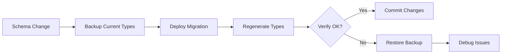

# PrayerMap Database Documentation

Complete documentation for PrayerMap's Supabase database schema, RPC functions, type management, and optimization strategies.

---

## 📚 Documentation Index

### Core Guides

1. **[TYPE_REGENERATION.md](./TYPE_REGENERATION.md)** ⭐ **START HERE**
   - Complete guide to TypeScript type generation
   - When to regenerate types
   - All new function signatures from 2025-11-29 optimization sprint
   - Manual vs automatic generation methods
   - Type safety best practices

2. **[TYPE_SYNC_STATUS.md](./TYPE_SYNC_STATUS.md)** ⚠️ **ACTION REQUIRED**
   - Current status of type definitions
   - List of missing type definitions for new functions
   - Impact analysis and migration path
   - Next steps and priorities

3. **[NPM_SCRIPTS_ADDITIONS.md](./NPM_SCRIPTS_ADDITIONS.md)** 🛠️ **RECOMMENDED**
   - Ready-to-copy npm scripts for package.json
   - Complete workflow examples
   - CI/CD integration guidance
   - Troubleshooting common issues

4. **[QUICK_REFERENCE.md](./QUICK_REFERENCE.md)** ⚡ **QUICK LOOKUP**
   - Command quick reference
   - Function overview table
   - File location index

### Optimization Guides

5. **[OPTIMIZATION_SUMMARY.md](./OPTIMIZATION_SUMMARY.md)** ⭐ **DATABASE OPTIMIZATION SPRINT**
   - Complete database optimization summary (2025-11-29)
   - 80%+ data reduction, O(1) pagination, performance monitoring
   - 7 migrations: server-side limiting, cursor pagination, indexes
   - Deployment checklist and rollback plan
   - Adherence to CLAUDE.md and ARTICLE.md principles

6. **[NEARBY_PRAYERS_OPTIMIZATION.md](./NEARBY_PRAYERS_OPTIMIZATION.md)**
   - Optimization of get_nearby_prayers function
   - Performance impact analysis
   - Mobile-specific considerations

7. **[AGENT_SUMMARY.md](./AGENT_SUMMARY.md)**
   - Multi-agent execution summary
   - Parallel optimization workflow

---

## 🚀 Quick Start

### New to the Project?

1. Read [TYPE_REGENERATION.md](./TYPE_REGENERATION.md) to understand type management
2. Check [TYPE_SYNC_STATUS.md](./TYPE_SYNC_STATUS.md) for current status
3. Add npm scripts from [NPM_SCRIPTS_ADDITIONS.md](./NPM_SCRIPTS_ADDITIONS.md)
4. Run `npm run db:types:sync` to regenerate types

### Just Need Commands?

See [QUICK_REFERENCE.md](./QUICK_REFERENCE.md) for copy-paste commands.

---

## 📊 Current Database State

### Database Version
- **Schema Version:** v2 (prayermap_schema_v2.sql)
- **Latest Migration:** 2025-11-29 (Database Optimization Sprint)
- **Type File:** `/home/user/prayermap/src/types/database.ts`

### Tables
- `prayers` - Prayer requests with location and content
- `prayer_responses` - Responses to prayers (text/audio/video)
- `prayer_connections` - Visual connections between prayers and responses

### RPC Functions (Existing ✅)
- `get_nearby_prayers` - Fetch prayers within radius
- `create_prayer_connection` - Create prayer connection line
- `cleanup_expired_connections` - Remove old connections

### RPC Functions (New ⚠️ Types Missing)
- `get_all_prayers` - Optimized global prayer fetch
- `get_all_connections` - Fetch all prayer connections
- `get_prayers_paginated` - Cursor-based pagination
- `get_performance_stats` - Performance monitoring

---

## 🎯 Common Tasks

### Regenerate Types After Schema Change

```bash
# Recommended: Full sync with verification
npm run db:types:sync

# Or step-by-step
npm run db:types          # Generate from production
npm run db:types:verify   # Verify compilation
```

### Test Types Locally

```bash
# Start local Supabase
npx supabase start

# Generate types from local DB
npm run db:types:local

# Verify
npm run db:types:verify
```

### Deploy Database Changes

```bash
# 1. Apply migration to production
npx supabase db push

# 2. Regenerate types
npm run db:types:sync

# 3. Commit changes
git add src/types/database.ts supabase/migrations/
git commit -m "feat: add new database functions + regenerate types"
```

---

## 📁 File Locations

### Documentation
```
/home/user/prayermap/docs/database/
├── README.md                              (This file)
├── TYPE_REGENERATION.md                   (Main type guide)
├── TYPE_SYNC_STATUS.md                    (Current status)
├── NPM_SCRIPTS_ADDITIONS.md               (npm scripts)
├── QUICK_REFERENCE.md                     (Quick commands)
├── OPTIMIZATION_SUMMARY.md                (Database optimization sprint summary ⭐)
├── NEARBY_PRAYERS_OPTIMIZATION.md         (Optimization example)
├── AGENT_SUMMARY.md                       (Multi-agent summary)
└── archive/                               (Archived TODO and migration files)
    ├── README.md
    ├── TODO_RESOLUTION_limit_count.md
    └── MIGRATION_NEEDED_limit_count.md
```

### Code
```
/home/user/prayermap/
├── src/types/database.ts                  (TypeScript definitions)
├── supabase/migrations/                   (Database migrations)
├── prayermap_schema_v2.sql               (Full schema)
└── src/services/prayerService.ts         (Database service layer)
```

---

## 🔄 Type Management Workflow

### Standard Workflow


### Safe Workflow (with Backup)


---

## 🎓 Learning Resources

### Internal Documentation
1. Start with [TYPE_REGENERATION.md](./TYPE_REGENERATION.md)
2. Review [TYPE_SYNC_STATUS.md](./TYPE_SYNC_STATUS.md) for current gaps
3. Implement scripts from [NPM_SCRIPTS_ADDITIONS.md](./NPM_SCRIPTS_ADDITIONS.md)
4. Study [NEARBY_PRAYERS_OPTIMIZATION.md](./NEARBY_PRAYERS_OPTIMIZATION.md) for patterns

### External Resources
- [Supabase TypeScript Guide](https://supabase.com/docs/guides/api/generating-types)
- [Supabase CLI Reference](https://supabase.com/docs/reference/cli)
- [PostGIS Documentation](https://postgis.net/docs/)
- [PostgreSQL Functions](https://www.postgresql.org/docs/current/sql-createfunction.html)

---

## ⚠️ Important Notes

### Type Safety
- **Current Status:** Types are **out of sync** with database schema
- **Impact:** Limited autocomplete and type safety for new functions
- **Action Required:** Run `npm run db:types:sync` to update
- **Priority:** Medium (no runtime errors, but limits developer experience)

### Database Functions
- All new functions (2025-11-29) are **deployed and working**
- TypeScript types need regeneration to enable full type safety
- See [TYPE_SYNC_STATUS.md](./TYPE_SYNC_STATUS.md) for details

### Mobile Considerations
- All database queries optimized for mobile performance
- Default limits prevent excessive data transfer
- Battery-conscious query patterns implemented
- See optimization guides for details

---

## 📞 Support

### Common Questions

**Q: Which document should I read first?**
A: [TYPE_REGENERATION.md](./TYPE_REGENERATION.md) - it's the comprehensive guide.

**Q: My types are out of sync. What do I do?**
A: Check [TYPE_SYNC_STATUS.md](./TYPE_SYNC_STATUS.md) for status and instructions.

**Q: I need to add npm scripts. Where?**
A: [NPM_SCRIPTS_ADDITIONS.md](./NPM_SCRIPTS_ADDITIONS.md) has ready-to-copy scripts.

**Q: I just need quick commands.**
A: [QUICK_REFERENCE.md](./QUICK_REFERENCE.md) has all commands in one place.

### Troubleshooting

For troubleshooting:
1. Check the "Troubleshooting" section in [NPM_SCRIPTS_ADDITIONS.md](./NPM_SCRIPTS_ADDITIONS.md)
2. Review [TYPE_SYNC_STATUS.md](./TYPE_SYNC_STATUS.md) for known issues
3. Verify Supabase CLI authentication: `npx supabase login`
4. Check environment variables and project ID

---

## 🔮 Future Improvements

### Planned
- [ ] Automated type regeneration on schema changes
- [ ] Type validation in CI/CD pipeline
- [ ] Pre-commit hooks for type verification
- [ ] Type changelog for breaking changes
- [ ] Automated type drift detection

### Under Consideration
- [ ] Custom PostGIS type helpers
- [ ] Shared types between frontend and admin
- [ ] Type generation from Zod schemas
- [ ] GraphQL type generation (if implemented)

---

## 📝 Change Log

| Date | Change | Documents Updated |
|------|--------|-------------------|
| 2025-11-29 | **Database Optimization Sprint Complete** | OPTIMIZATION_SUMMARY.md (NEW), 7 migrations, archive/ created |
| 2025-11-29 | Database optimization sprint (initial) | TYPE_REGENERATION.md, TYPE_SYNC_STATUS.md, NPM_SCRIPTS_ADDITIONS.md created |
| 2025-01-29 | Nearby prayers optimization | NEARBY_PRAYERS_OPTIMIZATION.md created |

---

## 🤝 Contributing

When adding new database functions:

1. **Before deployment:**
   - Write migration file
   - Test locally with `npx supabase db reset`
   - Document in appropriate guide

2. **After deployment:**
   - Run `npm run db:types:sync`
   - Update TYPE_SYNC_STATUS.md
   - Add usage examples to TYPE_REGENERATION.md
   - Commit type changes

3. **Documentation:**
   - Update this README if adding new guides
   - Keep QUICK_REFERENCE.md current
   - Add troubleshooting notes as discovered

---

**Maintained By:** PrayerMap Development Team
**Last Updated:** 2025-11-29
**Status:** Active Development
**Version:** 2.0 (Database Optimization Edition)
